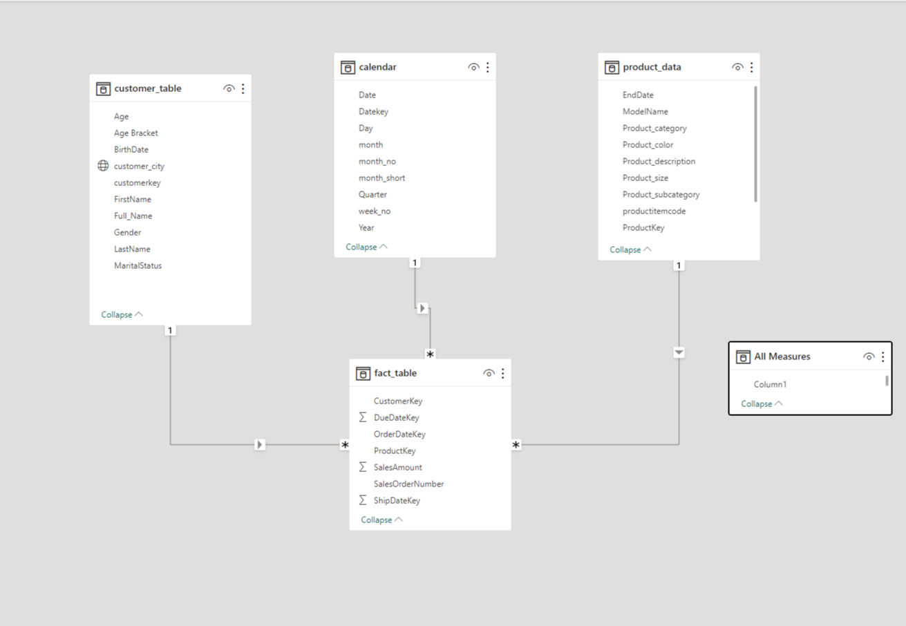
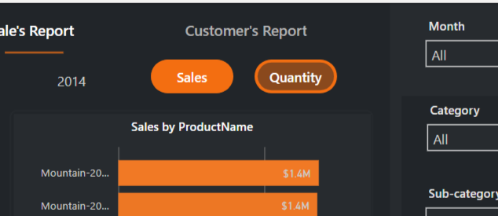
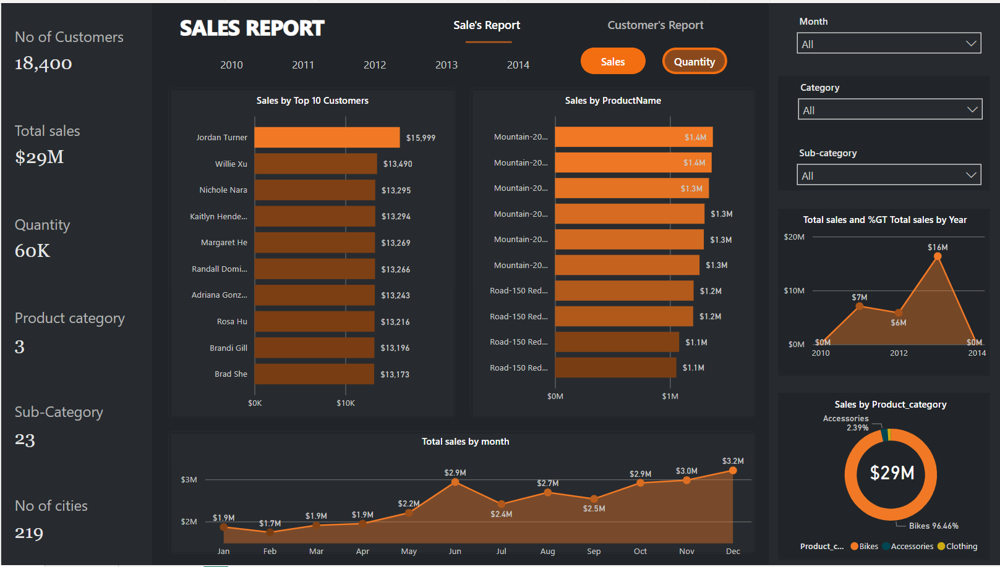
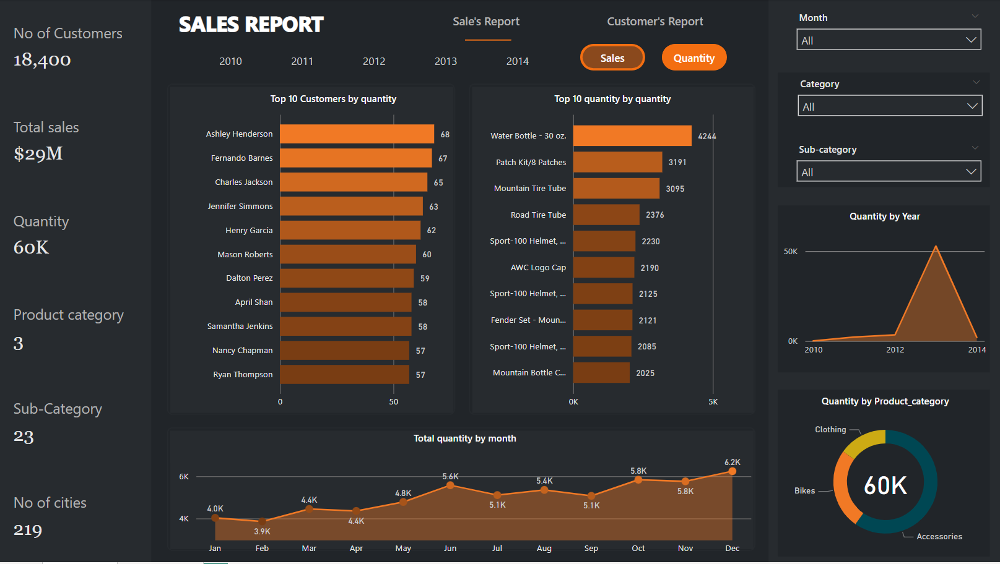
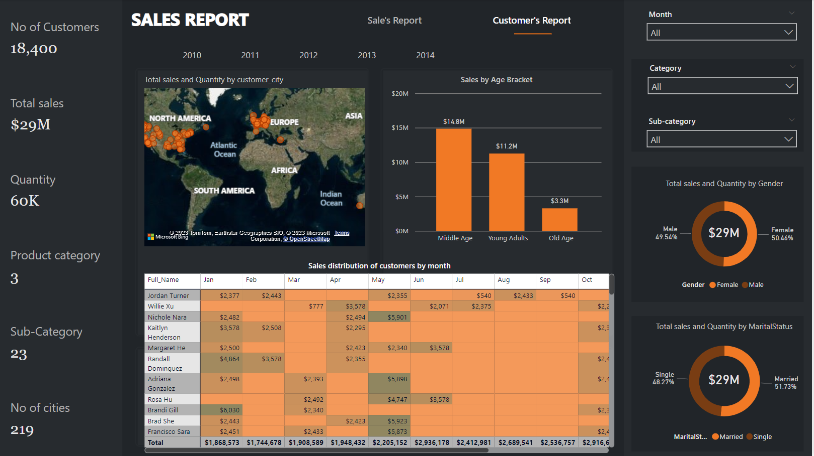

# Sales Analysis
### You can interact with the report [HERE](https://app.powerbi.com/view?r=eyJrIjoiZjIwZGQ4YmMtZDc5NC00YjFlLWEyMWItYTJjMDBkZDhkZWRiIiwidCI6ImI5NjBjM2ZmLWE4ODktNDQzOC05N2QwLTZlZjFiYTY2MzZhMiJ9)

## Introduction
Welcome to the exciting world of data analysis! In this documentation, we delve into an in-depth exploration of sales and customer data, leveraging the comprehensive Adventure Works dataset. Our analysis aims to uncover valuable insights and trends that lie within the data, shedding light on the dynamics of sales, customer behavior, and more. Join us on this journey as we navigate through the numbers, revealing actionable findings that can drive strategic decisions and enhance business outcomes.

## Data Source
The data used for this project was from the adventure works database.

## Task
1. Sales Trends and Period Analysis:
Analyzing sales trends across months and years and Identifying growth patterns and seasonal fluctuations.

2. Top Customers and Product Performance:
Recognizing top customers with significant sales contributions and Highlighting exceptional products in terms of sales value and quantity.

3. Customer Demographics and Sales Correlation:
Exploring correlations between customer demographics and sales and Personalizing marketing efforts based on customer characteristics.

4. Geographic Sales Hubs.
Locating major sales hubs geographically.

5. Customer distribution across all months based on the sales revenue.-+-

## Data Preparation and Transformation
To prepare dataset for analysis, SQL was used to extract and generate the required tables from the database. In response to the given task, a careful assessment of the necessary database tables was carried out. Specifically, the following tables were selected: dimdate, dimcustomer, dimgeography, dimproduct, dimproductcat, and dimproductsubcat. These tables formed the basis for the subsequent steps.

Building upon this foundation, four core tables were derived using targeted SQL queries. These resulting tables are categorized as follows: customer table, calendar table, product table, and fact table. The accompanying SQL statements outline the specific methodologies that were executed to generate these pivotal tables, serving as integral components for our subsequent analytical endeavors.

To form the fact table, we selected key details from the fact_internetsales table. This table became the central point where all the other tables in our analysis could link to. By using specific columns from this table, we established connections to other related tables. This structure allowed us to build a framework for better comprehending and processing the data.

```sql
SELECT 
    ProductKey,
    OrderDateKey,
    DueDateKey,
    ShipDateKey,
    CustomerKey,
    SalesOrderNumber,
    SalesAmount
FROM fact_internetsales;
```

Likewise, a similar procedure was undertaken to craft the calendar table. Drawing from the dimdate table within our database, essential columns were extracted to compose the structure of our calendar table. This process ensured that pertinent date-related information was distilled and organized, providing a valuable resource for our analysis.

```sql
SELECT 
    Datekey, 
    FullDateAlternateKey AS `Date`, 
    EnglishDayNameOfWeek AS `Day`,
    WeekNumberOfYear AS week_no, 
    EnglishMonthName AS `Month`, 
    MonthNumberOfYear AS month_no, 
    LEFT(EnglishMonthName, 3) AS month_short,
    CalendarQuarter AS `Quarter`, 
    CalendarYear AS `Year`
FROM dimdate;
```

Creating the customer's table posed several challenges that required thoughtful solutions:
1. To ensure a distinctive representation of customers, the first name and last name had to be concatenated into a full name format.
2. The marital status column contained only 'M' and 'S' values. To enhance clarity, these were transformed into 'Married' and 'Single'.
3. Similarly, the gender column was addressed by replacing 'M' with 'Male' and 'F' with 'Female'.
4. Utilizing the birthdate column, the Age column was derived by calculating the age relative to the most recent date in the calendar table, which was '2014-12-31'.
5. Additionally, an Age Bracket column was introduced, categorizing ages into three groups: 'Young Adult' (28-39 years), 'Middle Age' (40-59 years), and 'Old Age' (60-100 years). This segmentation facilitated a more meaningful understanding of customer demographics.

```sql
SELECT 
    c.customerkey, 
    c.FirstName,
    c.LastName, 
    CONCAT(c.FirstName, ' ', c.LastName) AS Full_Name,
    CASE c.MaritalStatus 
        WHEN 'M' THEN 'Married'
        WHEN 'S' THEN 'Single'
    END AS MaritalStatus,
    CASE c.Gender 
        WHEN 'M' THEN 'Male'
        WHEN 'F' THEN 'Female'
    END AS Gender,
    g.city AS customer_city,
    BirthDate, 
    floor(datediff('2014-12-31', BirthDate)/365) AS Age,
    CASE
        WHEN floor(datediff('2014-12-31', BirthDate)/365) BETWEEN 28 AND 39 THEN 'Young Adults'
        WHEN floor(datediff('2014-12-31', BirthDate)/365) BETWEEN 40 AND 59 THEN 'Middle Age'
        WHEN floor(datediff('2014-12-31', BirthDate)/365) BETWEEN 60 AND 100 THEN 'Old Age'
        ELSE 'Unknown'
    END AS Age_bracket
FROM dim_customer c 
LEFT JOIN dimgeography g ON c.GeographyKey = g.geographykey
ORDER BY c.customerkey;
```
When making the product table, we used a process similar to what we did for the calendar and the fact tables. This way of working was kept the same to maintain consistency across the analysis, helping to create a unified structure for studying the data.

```sql
SELECT  
    p.ProductKey, 
    p.ProductAlternateKey AS productitemcode, 
    p.EnglishProductName AS ProductName, 
    x.EnglishProductSubcategoryName AS Product_subcategory, 
    y.EnglishProductCategoryName AS Product_category,
    p.Color AS Product_color, 
    p.Size AS Product_size, 
    p.ProductLine, 
    p.ModelName, 
    p.EnglishDescription AS Product_description, 
    p.StartDate, 
    p.EndDate
FROM product p
LEFT JOIN dimproductsubcat x ON p.ProductSubcategoryKey = x.ProductSubcategoryKey
LEFT JOIN dimproductcat y ON x.ProductCategoryKey = y.ProductCategoryKey;
```

After executing these code sequences, the resulting tables were saved as CSV files. These CSV files were then imported into Power BI for additional analysis and visualization purposes. This workflow allowed for the data to be transformed into a format suitable for Power BI, where it could be explored visually and analyzed in depth.

## Data Modelling
After importing these files into Power BI, I structured the data and established a proper relationship between them, adhering to a star schema design. This pivotal step ensured seamless integration of data across tables, facilitating comprehensive analysis and visualization within Power BI. The resulting relationships is shown below:



## Data Exploration and Visualization
As I structured the tables, I made sure to create important calculations that would help our analysis. These calculations included key measures like the total sales, total quantities sold, the number of customers, the count of product categories, the count of product sub-categories, and the count of cities. Adding these calculations was a smart move, as they gave us more ways to understand the data and find useful information.

### Sales Report - Visualization
During the visualization process, a range of insights became apparent, which I will elaborate upon. To start, a comprehensive overview of our sales and customer metrics was provided through an information card. The top 10 customers and the top 10 products were identified based on both sales value and quantity sold. Furthermore, the sales trend over the entire timeframe, broken down by months and years, was showcased. For enhanced analytical exploration, slicers were introduced, allowing for focused drill-through. These slicers, spanning years, months, product categories, and subcategories, facilitated more targeted analysis. The sales report was differenciated in terms of sales and quantity by the use of navigation button shown below:



Recognizing the potential need to address questions related to quantities rather than total sales, I implemented a navigation button. This button enabled a seamless transition to an analysis centered on quantities, addressing a specific aspect of the data for a more comprehensive perspective. The visual reorts in terms of both sales and quantity are shown below:

| sales report(sales revenue) | sales report(quantity) |
|-----------------------------|------------------------|
|           |  |


### Customers Report - Visualization

Within the customers report, a range of visualizations were constructed to illuminate various aspects. Firstly, a visual depiction of age bracket distribution in relation to total sales was generated, shedding light on how different age groups contribute to overall sales. Similarly, separate visuals illustrated the correlation between customer gender, marital status, and total sales, offering distinct insights.The visual reort is shown below:



Employing a map visualization, geographical data was harnessed to reveal the origins of sales and their magnitudes across cities. Additionally, a table was created to present customer names alongside the total revenue they generated over the course of a month, furnishing a comprehensive understanding of individual customer contributions.

Incorporating the same slicers employed in the sales report, a consistent framework was established for the customers report, enabling a cohesive analysis across both domains. The sales report was differenciated from the customer by the use of navigation button shown below:


### You can interact with the report [HERE](https://app.powerbi.com/view?r=eyJrIjoiZjIwZGQ4YmMtZDc5NC00YjFlLWEyMWItYTJjMDBkZDhkZWRiIiwidCI6ImI5NjBjM2ZmLWE4ODktNDQzOC05N2QwLTZlZjFiYTY2MzZhMiJ9)

## Insights and Recommendations

1. The top 10 customers, based on their significant sales contributions, play a vital role in boosting the company's revenue. These high-value customers likely possess considerable purchasing power. Notably, no customer appears on both the high sales and high quantity lists, indicating a distinct nature between the two categories. Nonetheless, being present on either list signifies customer loyalty, showing commitment to the company through either high-value transactions or frequent engagement.

2. Over a span of 5 years, our analysis covered a range of intriguing sales trends. The total sales figure across this period amounted to $29 million. Between 2010 and 2011, there was a notable surge in total sales, reaching $7 million. The subsequent year, 2012, witnessed a decrease to $6 million. An unprecedented peak emerged in 2013, recording the highest annual sales of $16 million. The graph's decline beyond 2013 is attributed to sales concluding in January 2014.
Anticipating post-2014 sales, the optimism is grounded in January 2014's surpassing of 2013's peak and the consistent sales growth from January to December. Overall, the analysis provides a positive outlook for sales beyond 2014, backed by compelling evidence.

4. The data highlights the pivotal role of bikes as the primary revenue driver, contributing an impressive 96.46% of the total sales revenue. This dominance underscores the significance of bikes in the company's sales strategy. Additionally, accessories and clothing, while contributing smaller portions of sales revenue (2.39% and 1.16% respectively), remain integral components of the product portfolio.
Quantity Distribution Patterns:
Shifting focus to quantity, a unique trend emerges. Accessories command the highest quantity share at 59.76%, signifying their popularity in terms of sheer volume. Bikes follow, representing 25.17% of the total quantity, while clothing contributes 15.07%.

Strategic Insights:
This interplay between revenue and quantity carries strategic implications:

•	Capitalizing on Bikes' Revenue Dominance: The strong revenue contribution from bikes warrants continued investment and innovation in this category.

•	Exploring Accessories' Upselling Potential: While accessories contribute modestly to revenue, their high quantity share suggests potential for upselling and bundling strategies.

 •	Leveraging Clothing's Quantity Potential: Despite modest revenue, clothing's substantial quantity contribution suggests untapped potential for expanding its market impact.

6. The middle age group significantly contributed to sales, adding $14.8 million, indicating their strong purchasing power. Young adults also played a crucial role, generating $11.2 million in sales, highlighting the importance of understanding their preferences. Even older customers made an impact with $3.3 million in sales, suggesting opportunities to cater to their preferences as well. Overall, different age groups all contribute significantly to sales, underscoring the need to tailor offerings to their respective preferences and purchasing behaviors. These insights show that different ages affect sales differently. This helps us know how to make products and market them better for each group.

7. Sales reached $29 million, with almost the same number of purchases from male (49.54%) and female (50.46%). This shows that both genders liked what was being sold. It also means we can make special plans to sell things that men and women prefer. By looking at what each gender buys the most, we can make those things even better. This equal split tells us that it's important to treat everyone the same when we advertise and sell things.  This shows that everyone likes what's being sold. It also tells us that there's a chance to make smart plans that consider what males and females might like a little differently. This helps everyone feel included and happy with what they buy.

8. Paris shines as the standout city among the 219 analyzed, not only for its impressive sales worth around $539,725 but also for leading in sales quantity. These substantial sales contribute about 2% to the total sales across all cities, showcasing Paris's pivotal role. Other strong contributors like Wollongong, Warrnambool, and Bendigo follow suit, emphasizing diverse regional sales excellence driven by varying market dynamics and consumer preferences.

9. Looking at marital status, singles contribute 48.27% of the total sales revenue, while married individuals contribute 51.73% of the total sales revenue. This insight suggests that the difference in sales revenue between singles and married individuals is relatively small, indicating that both groups play a significant role in driving sales for the company. This balance highlights the importance of catering to the preferences and needs of both marital status categories, ensuring that products and marketing strategies resonate effectively with a diverse customer base.

### You can interact with the report [HERE](https://app.powerbi.com/view?r=eyJrIjoiZjIwZGQ4YmMtZDc5NC00YjFlLWEyMWItYTJjMDBkZDhkZWRiIiwidCI6ImI5NjBjM2ZmLWE4ODktNDQzOC05N2QwLTZlZjFiYTY2MzZhMiJ9)

## Conclusion
In conclusion, my thorough analysis of the data has illuminated valuable insights into customer behavior, product preferences, and sales dynamics. From dissecting age-based contributions to understanding gender and marital status impacts, I've gained a comprehensive understanding of our customer base. Exploring city-wise sales highlights and product category distributions has provided strategic directions for growth. These insights serve as a compass, guiding us towards tailored marketing strategies, optimized product offerings, and enhanced customer experiences. By leveraging these findings, I am poised to make informed decisions that will drive our business forward, fostering continued success in an ever-evolving market landscape.
